---
format:
  revealjs:
    scrollable: true
    self-contained: false
    slide-number: "c/t"
    incremental: false
    reference-location: document
    progress: true
    width: 1600
    height: 900
    logo: "images/hari_slides/Texas-AM-Logo.png"
    footer: ""
    theme: ["simple", "styles-tamu.scss"]
    code-link: true
    multiplex: false
execute:
  echo: false
editor:
  markdown:
    wrap: 72
---

# {data-menu-title="Title Slide" style="text-align: center;" data-background-color="#FFFFFF"}

::: {style="margin-top: 50px;"}

<h1 style="font-size: 2.5em; margin-top: 0; line-height: 1.2;">
Experiential Learning & Gender Stereotypes in Science Education
</h1>

Evidence from a Field Intervention

 

UW Foster School of Business | February 7, 2025

 

**Shrihari (Hari) Sridhar**

Joe B Foster '56 Chair in Business Leadership   Senior Associate Dean

Mays Business School, Texas A&M University

 

**Joint work with:** Muzeeb Shaik, Huanhuan Shi, Adithya Pattabhiramaiah

:::

## Research Evolution {.smaller}

<!-- Box 1: Marketing Resource Allocation -->

Marketing Resource Allocation

• Media Platforms

<!-- Arrow 1 -->

➔

<!-- Box 2: Financial Impact -->

Financial Impact of Marketing Strategy

• Digital Platforms 
• B2B 
• Healthcare 
• Education

<!-- Arrow 2 -->

➔

<!-- Box 3: Financial and Societal Impact -->

Financial and Societal Impact of Marketing Strategy

• Digital Platforms 
• B2B 
• Healthcare 
• Education

## SDIAS and School Disciplinary Problems {.smaller}

<!-- Box 1 -->

$1 million increase in school district internet access spending

→

<!-- Box 2 -->

7% increase in the number of lower-severity disciplinary problems in a school

→

<!-- Box 3 -->

$5,529~$11,451 increase in cost to a school

→

<!-- Box 4 -->

$38,700~$80,160 increase in cost to a school district*

 

::: {.callout-important}
## Implication
Technology investments in schools can have unintended behavioral consequences that need to be considered
:::

::: {.callout-tip}
## Reference
Chen et al. *Journal of Marketing Research* (2021)
:::

## Personalized Cancer Screening Saves Money and Lives {.smaller}

<!-- Image 1 - Base layer -->

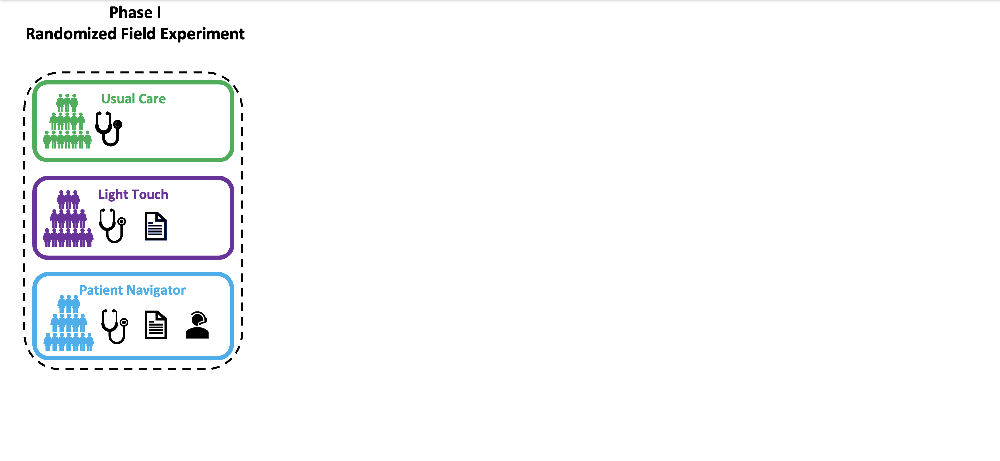

<!-- Image 2 -->

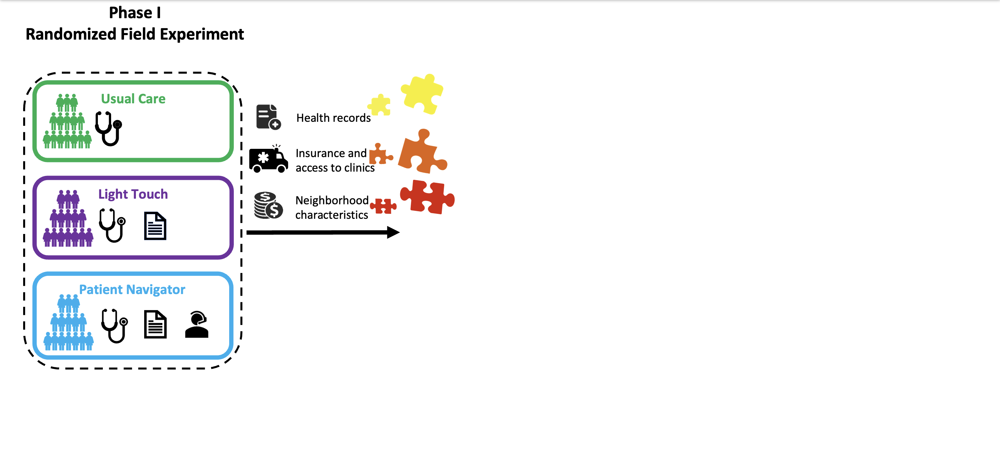

<!-- Image 3 -->

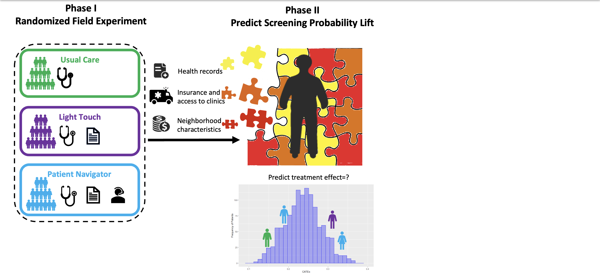

<!-- Image 4 -->

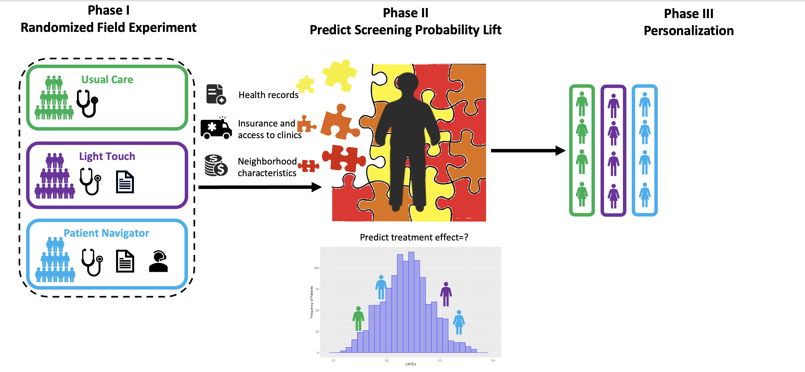

<!-- Image 5 - Final -->

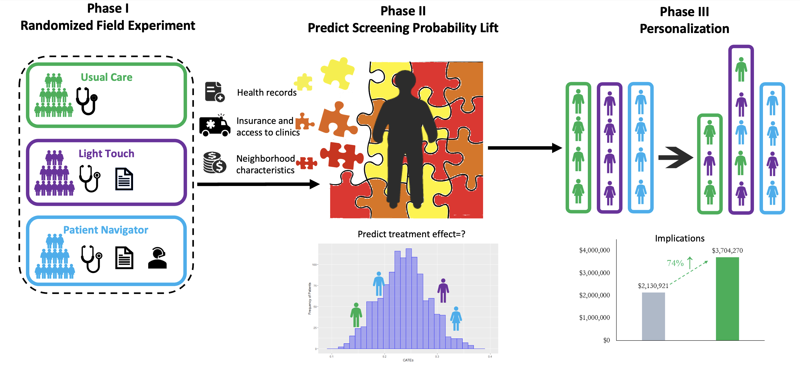

::: {.callout-tip}
## Reference
Chen et al. *Journal of Marketing* (2020)
:::

## How Fatal School Shootings Impact a Community's Consumption {.smaller}

### Research Question

How do fatal school shootings affect grocery and public consumption in affected communities?

<!-- Key Findings Box -->

<h4 style="color: #500000; margin-top: 0;">Key Findings</h4>

-   **-2.09%** decrease in grocery spending after incidents
-   **-1.17%** fewer shopping days
-   **-1.25%** fewer unique stores visited
-   Effects stronger in **liberal-leaning counties**

<!-- Mechanism Box -->

<h4 style="color: #500000; margin-top: 0;">Mechanism</h4>

-   **Anxiety** drives reduced consumption
-   Effect specific to **public consumption** contexts
-   Moderated by **political ideology**

 

::: {.callout-important}
## Implications
Understanding community-level behavioral responses to trauma is critical for local stakeholders and marketers
:::

::: {.callout-tip}
## Reference
Shaik et al. *Journal of Marketing Research* (2025)
:::

# Experiential Learning & Gender Stereotypes in Science Education {.center}

## The Gender Gap in STEM: A Global Challenge {.smaller}

::::::::::: columns
:::::: {.column width="50%"}
::: fragment
### Global Picture

-   Education: **4–5% of global GDP** (~USD 4.4–5.6 trillion annually)
-   Women: only **35%** of STEM graduates worldwide
-   In the US: **38.8%** of science bachelor's degrees
-   Only **26%** of the US STEM workforce
:::
::::::

:::::: {.column width="50%"}
::: fragment
### India: Our Study Context

-   Women: **43%** of total undergraduate enrollment
-   But only **29%** in STEM disciplines
-   Fewer than **18%** of scientists/engineers in labor force
-   **Opportunity:** Gender parity → **10–12 million** more STEM workers
:::
::::::
:::::::::::

:::: fragment
::: {.callout-note icon="false" appearance="minimal"}
## Today's Talk

What if we could address gender stereotypes **indirectly**, not through persuasion campaigns, but by **redesigning the learning experience itself**?
:::
::::

## Three Categories of Prior Interventions {.smaller}

::::::::: columns
::::: {.column width="33%"}
:::: fragment
### 1. Push Campaigns

-   Awareness campaigns
-   Mass communication
-   Public service announcements
-   Media messaging

**Goal:** Persuade individuals to reconsider stereotypes

*(Paluck et al. 2021; Hermann et al. 2022)*
::::
:::::

::::: {.column width="33%"}
:::: fragment
### 2. Girls-Only Programs

-   After-school STEM activities
-   Mentoring programs
-   Interactions with STEM professionals
-   Separation as confidence-building

**Goal:** Close information gaps, build exposure

*(Dubetz & Wilson 2013; Levine et al. 2015)*
::::
:::::

::::: {.column width="33%"}
:::: fragment
### 3. Gender-Congruent Environments

-   Female role models
-   Feminine classroom décor
-   Identity-affirming cues

**Goal:** Counteract masculine coding of science

*(Master et al. 2016; Breda et al. 2023)*
::::
:::::
:::::::::

:::: fragment
::: callout-warning
## The Common Limitation

All three approaches **explicitly position gender as the focal problem** and attempt to address it through direct persuasion or identity-targeted messaging. **Evidence on effectiveness is mixed:** meta-analyses show modest effects that often fade over time, and some interventions can backfire by reinforcing the very stereotypes they aim to reduce.
:::
::::

------------------------------------------------------------------------

## Disadvantages of Direct Approaches {.smaller}

::: fragment
### These interventions risk **reactance**:
:::

::::::::: columns
::::: {.column width="33%"}
:::: fragment
**Push Campaigns**

-   May be dismissed as heavy-handed
-   Risk appearing tokenizing
-   Limited lasting impact on beliefs
::::
:::::

::::: {.column width="33%"}
:::: fragment
**Girls-Only Programs**

-   Can **reinforce** the very group boundaries they seek to dismantle
-   Signal that girls require specialized support
-   Create parallel tracks rather than inclusive culture
::::
:::::

::::: {.column width="33%"}
:::: fragment
**Gender-Congruent Cues**

-   Signal science requires **special adaptation** for women
-   Rather than science being a shared, gender-neutral domain
::::
:::::
:::::::::

:::: fragment
::: callout-note
## An Alternative Possibility

What if there's a way to preserve participation across genders and generate positive outcomes? An approach that engages **both boys and girls** together, where boys—who often hold stronger gender-stereotypical beliefs—can update their perceptions through shared experience?
:::
::::

## A Different Approach: Indirect Change

:::: fragment
::: {.callout-tip icon="false"}
## The Core Insight

Rather than **targeting gender perceptions directly**, what if we could produce gender-inclusive outcomes as a **collateral benefit** of redesigning the learning experience itself?
:::
::::

::: fragment
### Research Questions

**Primary:** Can experiential science learning, designed for *pedagogy* not gender, simultaneously improve science knowledge **and** reduce gender stereotypes?

**Secondary:**

-   Does the intervention affect boys and girls differently?
-   Do effects extend to broader attitudes about gender and competence?
:::

## Our Approach: A Pedagogy-First Service Intervention

::::::::: columns
::::: {.column width="55%"}
:::: fragment
::: {.callout-note icon="false"}
## Our approach is a pedagogy-first service intervention.

**The program was NOT designed to address gender stereotypes.**

Its primary objective is **pedagogical**: supplement chalk-and-talk instruction with experiential, hands-on science learning.

But its design includes features that may **inadvertently** reduce gendered perceptions of science.
:::
::::
:::::

::::: {.column width="45%"}
:::: fragment
**Study Design:**

-   **N = 5,216** students
-   **196** rural public schools
-   Bodoland, Assam, India
-   One academic year
-   Difference-in-differences
::::

:::: fragment
::: callout-tip
## Preview

**+14 pp** science knowledge gain | **~20%** reduction in gender stereotypes
:::
::::
:::::
:::::::::

## Roadmap for Today's Talk

::: incremental
-   **Theoretical Framework** - Shared experiential consumption & cross-gender contact
-   **Institutional Context** - Science education in rural India
-   **The Intervention** - Mobile Science Labs program design
-   **Research Design** - Sample, measures, and analytical approach
-   **Results** - Main effects and heterogeneity analyses
-   **Discussion** - Contributions and implications
:::

# Theoretical Framework

## Experiential Learning Can Change Perceptions and Outcomes {.smaller}

::::::::: columns
::::: {.column width="50%"}
:::: fragment
### Core Insight

**Experiential learning interventions can change both knowledge and social perceptions.**

When science learning is structured as **shared experiential consumption**, cross-gender collaboration triggers **belief updating**:

-   Students observe counter-stereotypical competence firsthand
-   Direct evidence challenges prior gender-science associations
-   Shared experience creates common identity around science

*(Ramanathan & McGill 2007; Allport 1954; Pettigrew & Tropp 2006)*
::::
:::::

::::: {.column width="50%"}
:::: fragment
### Our Approach vs. Direct Interventions

::: {style="font-size: 0.9em;"}
| Direct Approaches | Our Approach |
|-------------------|--------------|
| Persuasion/messaging | **Direct experience** |
| Separate girls from boys | **Shared domain** |
| Role models/cues | Students as **evidence** |
| Inclusion as external layer | **Embed inclusion** |
:::

::: callout-note
## Key Difference

Students encounter counter-stereotypical participation **organically** through mixed-gender collaboration under conditions of equal status, common goals, and institutional support
:::
::::
:::::
:::::::::

## The Delivery Mechanism: Experiential Learning {.smaller}

::::::::: columns
::: {.column width="45%"}
:::: fragment
**Kolb's Experiential Learning Cycle (1984)**

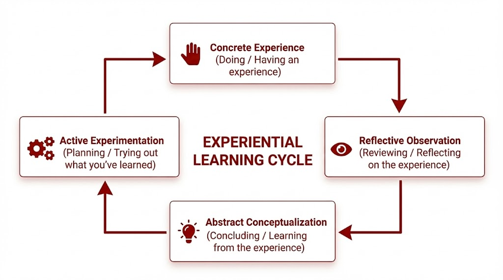{width="80%"}
::::
:::

::::::: {.column width="55%"}
:::: fragment
### Theory of Change

**Input:** Experiential learning designed for *pedagogy*, not gender

**Mechanism:** Shared experiential consumption triggers **belief updating** through:

-   **Joint problem-solving** during experiments
-   **Collaborative sense-making** of results
-   **Equal participation** in learning tasks

**Dual Outcomes:** Learning gains (primary goal) AND stereotype reduction (collateral benefit)
::::
:::::::
:::::::::

## What We Expect to Find {.smaller}

::::::::: columns
::::: {.column width="50%"}
:::: fragment
### Primary Outcome: Science Knowledge

::: {.callout-tip icon="false"}
## The Pedagogical Goal

Experiential learning will **improve science knowledge** through:

-   Concrete experience with concepts
-   Reflective observation and discussion
-   Abstract conceptualization
-   Active experimentation and application
:::
::::
:::::

::::: {.column width="50%"}
:::: fragment
### Added Benefit: Reduced Stereotypes

::: {.callout-note icon="false"}
## The Indirect Effect

Shared experiential consumption may **reduce gender-stereotype attitudes** through:

-   Cross-gender contact under optimal conditions
-   Organic exposure to counterexamples
-   Weakening of group boundaries
-   Students experiencing science as "for us"
:::
::::
:::::
:::::::::

# Institutional Context

## Science Education in Indian Public Schools {.smaller}

::::::::: columns
::::: {.column width="50%"}
::: fragment
### The System

-   **70%** of students attend government schools
-   Critical for educational equity and access
-   Serves primarily low-income communities
-   **Why Indian public schools?** Large population with persistent gender gaps in STEM; traditional pedagogical methods provide clear contrast for intervention; findings can inform policy at scale
:::

::: fragment
### Infrastructure Challenges

-   **\>50%** of Grades 9-10 students learn science **without proper
    labs**
-   Remote areas lack dedicated laboratory facilities
-   Cannot engage in hands-on experiments
-   High student-teacher ratios: **20:1 to 27:1**
:::
:::::

::::: {.column width="50%"}
::: fragment
### Pedagogical Approach

-   Emphasis on **memorizing facts** from textbooks
-   Content-heavy, examination-focused curriculum
-   Only **14%** of classrooms use non-textbook materials
-   **Rote learning dominates** instruction
:::

::: fragment
### The Result

-   Passive, one-way information transfer
-   Minimal student engagement
-   No inquiry-based learning
-   Limited critical thinking development
:::
:::::
:::::::::

## Traditional Classroom Environment {.smaller}

::::::::: columns

::::: {.column width="60%"}
### What You See

-   **Gender-segregated seating** (boys on one side, girls on other)
-   Passive, lecture-based instruction
-   Teacher-centered pedagogy

### The Problem

-   Reinforces gender boundaries
-   No cross-gender collaboration

::: {.callout-warning}
## The Gap
Lack of hands-on, interactive learning: exactly where experiential learning could make a difference
:::
:::::
::::: {.column width="10%"}
:::::
::::: {.column width="30%"}
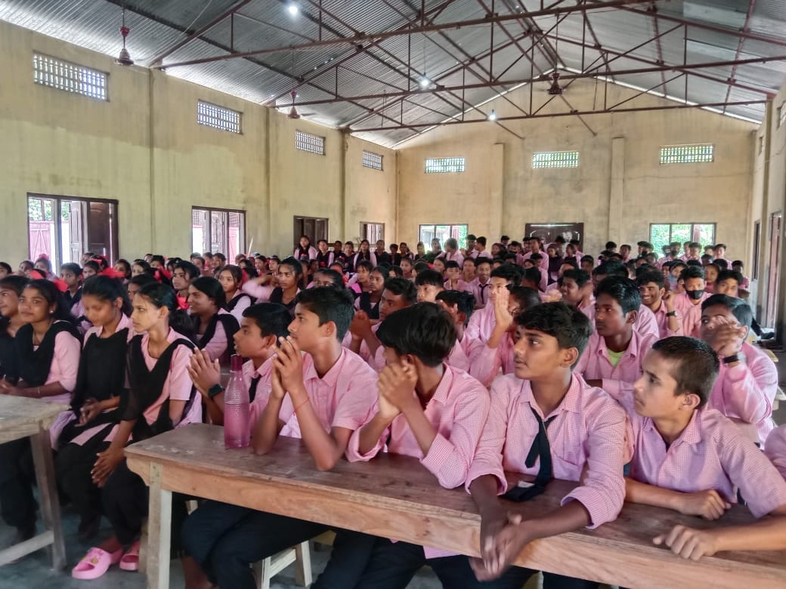{scale=1 fig-align="center"}

:::::
:::::::::

::: notes
**Talking Point:** "Before I show you our intervention, you need to
understand the context. In India, 70% of students attend government
schools, these are the backbone of the system. But more than half are
learning science without any lab facilities. Combine that with rote
learning pedagogy and 20-to-1 student-teacher ratios, and you have a
perfect storm: lots of memorization, zero hands-on experience, and no
opportunity for the kind of collaborative inquiry that creates
cross-gender contact. This is both a challenge and an opportunity."
:::

------------------------------------------------------------------------

## Study Location: Bodoland, Assam {.smaller}

::::::::: columns
::::: {.column width="50%"}
### Geographic Context

-   **Autonomous territorial region** in Northeast India (Assam state)
-   Established in 2003; Bodo population and other ethnic communities
-   Complex socio-political environment

### Why This Location?

-   **Clean baseline** - limited prior exposure to experiential learning
-   **High need** - underserved schools, resource constraints
-   **Scalability insights** - if it works here, it can work anywhere
:::::

::::: {.column width="50%"}
### Socioeconomic Profile

-   Widespread **socioeconomic disadvantage**
-   **Educational underdevelopment** compared to national averages
-   Predominantly rural population

### Educational Context

-   Schools operate with minimal facilities
-   Students have little exposure to hands-on science
-   Traditional gender norms prevalent
:::::
:::::::::

::: notes
**Talking Point:** "We conducted this study in Bodoland, an autonomous
region in Northeast India. This isn't an easy place to work. It's
economically disadvantaged, educationally underdeveloped, and has a
complex history of ethnic tensions. But that's exactly why it's
valuable. These schools have had minimal exposure to educational
innovations, so we can cleanly measure our intervention's impact. And if
experiential learning works here, in resource-constrained rural schools
with traditional gender norms, then it can work almost anywhere. This is
about external validity and policy relevance."
:::

## Mobile Science Labs (MSL) Program {.smaller}

::::::::: columns
::::: {.column width="60%"}
::: fragment
**Program Features:**

-   Vehicles equipped with lab equipment
-   Two instructors + one driver per MSL
-   Minimum 2 sessions per day
-   Reaches 1,200+ children annually per MSL
-   475,000+ students served as of 2024
:::

::: fragment
**Implementation:**

-   Eight 2-hour hands-on sessions per academic year
-   Sessions every few weeks throughout year
-   Subjects: Biology, Chemistry, Physics
:::
:::::

::::: {.column width="40%"}
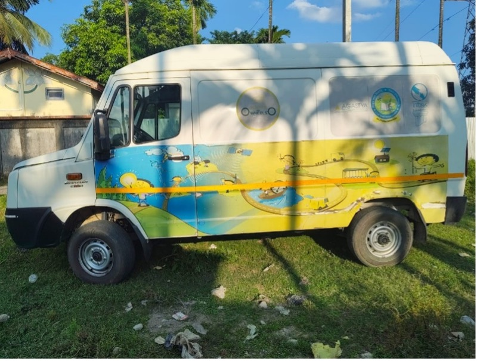{width="95%"}

:::: fragment
::: callout-tip
## Key Feature

Mixed-gender collaborative activities
:::
::::
:::::
:::::::::

## Students Engaged in Hands-On Learning {.smaller}

::::::::: columns
::::: {.column width="33%"}
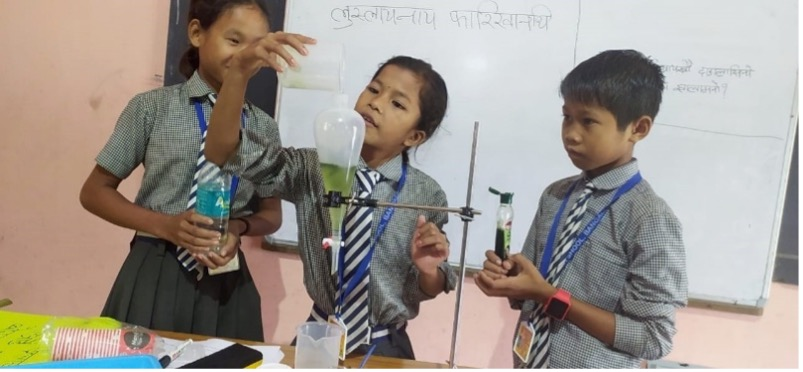{width="100%" height="280px" style="object-fit: cover;"}
:::::

::::: {.column width="33%"}
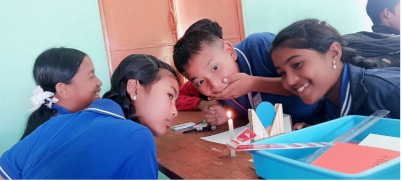{width="100%" height="280px" style="object-fit: cover;"}
:::::

::::: {.column width="33%"}
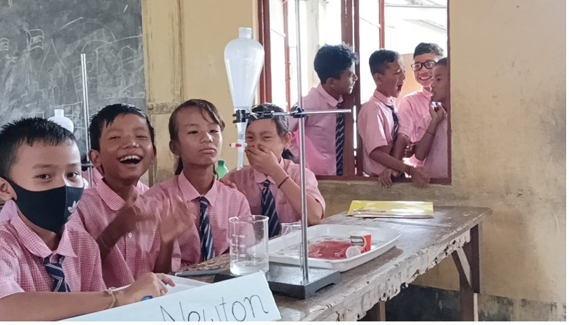{width="100%" height="280px" style="object-fit: cover;"}
:::::
:::::::::

::: {.callout-note}
## Key Observation
**Mixed-gender collaboration** in action: boys and girls working together on science experiments, creating conditions for belief updating through shared consumption
:::

## How MSL Creates Contact Conditions {.smaller}

:::::::::: fragment
### Operationalizing Intergroup Contact Theory

::::::::: columns
::::: {.column width="50%"}
**Theoretical Requirement** → **MSL Implementation**

::: fragment
**1. Equal Status**\
→ Boy-girl pairs **jointly lead** experiments in front of class\
→ Both genders perform same tasks
:::

::: fragment
**2. Common Goals**\
→ Understanding scientific concepts\
→ Successfully completing experiments\
→ Shared learning objectives
:::
:::::

::::: {.column width="50%"}
::: fragment
**3. Cooperation**\
→ Joint problem-solving required\
→ Collaborative sense-making\
→ Peer discussion and reflection
:::

::: fragment
**4. Institutional Support**\
→ Curriculum design mandates mixed-gender groups\
→ Instructor facilitation ensures equal participation\
→ School administration endorses program
:::
:::::
:::::::::
::::::::::

:::: fragment
::: callout-important
## The Design

MSL doesn't just teach science differently. It creates a **social
intervention** through the structure of collaborative learning
:::
::::

::: notes
**Talking Point:** "Remember the four conditions for effective
intergroup contact? Let me show you how MSL operationalizes each one.
Equal status: boy-girl pairs jointly lead experiments, no hierarchy.
Common goals: they're trying to understand the same scientific concepts
together. Cooperation: the experiments require joint problem-solving,
not competition. Institutional support: the curriculum design and
instructor facilitation ensure this happens. This isn't accidental. We've
deliberately engineered the contact conditions into the pedagogy."
:::

## MSL Curriculum Design: Kolb's Experiential Learning Cycle {.smaller}

:::::::::::: columns
:::::::: {.column width="70%"}
### Chemistry Example: Acids and Metal Carbonates

::::::: {layout-ncol="2"}
::: {.callout-note style="min-height: 220px;"}
## 1. Concrete Experience

-   Add sodium carbonate to test tube
-   Add dilute hydrochloric acid
-   Dip tube into limewater
-   **Mixed-gender teams work together**
:::

::: {.callout-warning style="min-height: 220px;"}
## 2. Reflective Observation

-   What did we observe?
-   Bubble formation, gas released
-   Limewater changing to milky
-   **Students share observations**
:::

::: {.callout-important style="min-height: 220px;"}
## 3. Abstract Conceptualization

-   Released gas is CO₂
-   CO₂ + limewater → calcium carbonate
-   **Generalization:** Acids + carbonates → CO₂
:::

::: {.callout-tip style="min-height: 220px;"}
## 4. Active Experimentation

-   Make their own limewater
-   Blow into it through straw
-   Observe milky color change
-   **Connect:** Exhaled air contains CO₂
:::
:::::::
::::::::

::::: {.column width="30%"}
### Session Structure

**Each session includes:**

-   **4-5 activities** covering all stages
-   **Mixed-gender teams** for every experiment
-   **Whole-class observation** and discussion
-   **Real-world connections**

::: callout-note
## The Cycle
Students experience → reflect → conceptualize → apply **together** in mixed-gender groups
:::
:::::
::::::::::::

::: notes
**Talking Point:** "Let me walk you through a typical session using a
chemistry example. Stage 1: A boy-girl pair performs the experiment in
front of the class, everyone observes the reaction between acid and
carbonate. Stage 2: The instructor facilitates discussion: what did you
see? Students reflect together. Stage 3: They learn the theory: it's CO₂
that turns limewater milky, and this happens with any acid and metal
carbonate. Stage 4: They apply it: blow into limewater yourself and see
it turn milky from the CO₂ in your breath. Notice what's happening
socially throughout this cycle: boys and girls are jointly doing
science, jointly making sense of it, jointly applying it. That's the
contact mechanism in action."
:::

# Research Design

## Study Design Overview {.smaller}

:::::::::: columns
:::::: {.column width="50%"}
### Sample Composition

::: fragment
**Total Sample:**

-   **N = 5,216 students**
-   **196 public schools**
-   **Grades 6-9** (middle school)
-   **Location:** Bodoland, Assam, India
:::

::: fragment
**Treatment Group:**

-   **4,608 students** (88% of sample)
-   Received MSL intervention
-   Eight 2-hour hands-on sessions over academic year
:::

::: fragment
**Control Group:**

-   **608 students** (12% of sample)
-   Regular public school education
-   No MSL intervention
:::
::::::

::::: {.column width="50%"}
### Research Design

::: fragment
**Design Type:**

-   **Two-wave panel design**
-   Pre-intervention (baseline) assessment
-   Post-intervention (endline) assessment\
-   **One academic year** duration
:::

::: fragment
**Analytical Approach:**

-   **Difference-in-differences** estimation
-   Individual fixed effects
-   School fixed effects
-   Clustered standard errors (school level)
-   Heterogeneity/moderation analyses
:::
:::::
::::::::::

::: notes
**Talking Point:** "Now for the research design. We worked with nearly
5,200 students across almost 200 schools in Bodoland. The treatment
group (about 4,600 students) received the MSL intervention over one
academic year. The control group (about 600 students) continued with
regular instruction. We measured outcomes before and after the
intervention, which lets us use a difference-in-differences design. This
is important because it accounts for any pre-existing differences
between treatment and control schools."
:::

## Primary Outcome Measures {.smaller}

::::::: columns
:::: {.column width="50%"}
### Science Knowledge Score

**Measurement:**

-   4 multiple-choice questions per assessment
-   Grade-specific content aligned with curriculum

**Sample Items:**

-   *"When a burning candle is covered with a glass jar, the flame goes out because..."* (Answer: oxygen is used up)
-   *"A ball is thrown upward. At the highest point, what forces act on it?"* (Answer: only gravity)

**Scoring:**

-   Percentage of items answered correctly (0-100%)
-   Enables cross-grade comparison
-   Captures applied reasoning (not rote recall)
::::

:::: {.column width="50%"}
### Gender-Stereotype Attitudes

**Measurement:**

-   Single-item: *"I feel science is for boys more than girls"*
-   5-point Likert scale (1 = Strongly disagree, 5 = Strongly agree)

**Interpretation:**

-   Higher scores = stronger gender stereotypes

**Rationale for Single Item:**

-   Appropriate for children/adolescents; avoids cognitive overload
-   Established practice (Deslauriers et al. 2019; Carlana et al. 2022)
::::
:::::::

::: notes
**Talking Point:** "Our first key outcome is science knowledge. We gave
students four multiple-choice questions at the beginning and end of the
year. These aren't memorization questions. They test whether students
actually understand scientific concepts and can apply them. We score
them as percentage correct, which lets us compare across grades even
though the specific questions differ. This measures the pedagogical
benefit of experiential learning. Our second key outcome measures gender
stereotypes. We asked students directly: 'I feel science is for boys
more than girls.' Five-point scale from strongly disagree to strongly
agree. This is intentionally simple and direct. Some might ask: why just
one question? For children, a single clear item is actually better than
a long battery of similar questions. It avoids confusion and fatigue
while still capturing the core belief we care about: do you think
science is gendered or not?"
:::

## Secondary Outcomes {.smaller}

::: fragment
**Science-Related Attitudes:**

-   Interest and enjoyment in science
-   Science self-efficacy
-   Long-term science orientation
-   Intentions to choose science major
-   14 total constructs measured
:::

::: fragment
**Gendered Perceptions (Post-intervention only):**

Two questions asking students to infer likely gender of high-performing
student:

-   **Science domain:** "A student performs very well in science. Is
    this student a boy or a girl?"

-   **Language arts domain:** "A student performs very well in language
    arts. Is this student a boy or a girl?"
:::

<!-- ## Outcome Measures -->

<!-- ### Design Strength -->

<!-- ::: {.callout-tip} -->

<!-- ## Causal Identification -->

<!-- - Random assignment at school level -->

<!-- - Pre differences accounted for -->

<!-- - Multiple fixed effects specifications -->

<!-- - Robust standard errors (school clusters) -->

<!-- - Large sample size -->

<!-- ::: -->

## Analytical Strategy {.smaller}

::: fragment
### Difference-in-Differences Framework

**Base specification:**

$Y_{ist} = \beta_0 + \beta_1 Treatment_s + \beta_2 Post_t + \beta_3 (Treatment_s \times Post_t) + \varepsilon_{ist}$

Where:

-   $Y_{ist}$ = outcome for student $i$ in school $s$ at time $t$
-   $Treatment_s$ = indicator for treatment school
-   $Post_t$ = indicator for post-intervention period
:::

::: fragment
### What Each Term Captures

-   $\beta_1$ (Treatment): Baseline difference between treatment and
    control
-   $\beta_2$ (Post): Time trend (change in control group)
-   $\beta_3$ (Treatment × Post): Additional change in treatment group
    beyond the control group = **CAUSAL EFFECT**
:::

# Results: Main Effects

## Model-Free Evidence: Science Knowledge

:::::: columns
::: {.column width="65%"}
{width="70%"}
:::

:::: {.column width="35%"}
::: {.callout-note .fragment}
## Note

-   **Catch-up Effect:** Treatment group started lower (16%) but
    overtook Control (29%) by endline.
-   **Gap Closed:** Intervention erased the initial disadvantage
    completely.
:::
::::
::::::

## Model-Free Evidence: Gender Stereotypes

:::::: columns
::: {.column width="65%"}
{width="70%"}
:::

:::: {.column width="35%"}
::: {.callout-note .fragment}
## Note

-   Control group attitudes **remained stable** over time.
-   **Treatment Success:** Intervention significantly reduced "Science
    is for boys" beliefs.
:::
::::
::::::

## Regression Results {.smaller}

:::: {.columns}

::: {.column width="75%"}
*Difference-in-Differences Estimates*

::: {style="font-size: 0.7em;"}

Panel A: Science Knowledge Score

| | Model 1 | Model 2 | Model 3 | Model 4 |
|---------|---------|---------|---------|---------|
| | No FE | School FE | School + Grade FE | School × Grade FE |
| [Treatment × Post]{style="color: #500000;"} | 13.763*** | 13.763*** | 13.763*** | 13.763*** |
| | (2.743) | (2.743) | (2.747) | (2.743) |
| | p<.001 | p<.001 | p<.001 | p<.001 |
| N | 10,432 | 10,432 | 10,432 | 10,432 |
| R² | .076 | .255 | .317 | .398 |

Panel B: Gender-Stereotype Attitudes

| | Model 1 | Model 2 | Model 3 | Model 4 |
|---------|---------|---------|---------|---------|
| [Treatment × Post]{style="color: #500000;"} | -0.595** | -0.576** | -0.575** | -0.573** |
| | (0.186) | (0.188) | (0.188) | (0.188) |
| | p=.002 | p=.003 | p=.003 | p=.003 |
| N | 10,214 | 10,214 | 10,214 | 10,214 |
| R² | .061 | .205 | .207 | .236 |

*Standard errors clustered at school level*

:::
:::

::: {.column width="25%"}

::: {.fragment}
::: {.callout-tip}
## Science Knowledge Score

**Effect: +13.8 pts**

88% improvement over baseline

Consistent across all specifications

✓ **Pedagogical success**
:::
:::

 
 
 

::: {.fragment}
::: {.callout-important}
## Gender-Stereotype Attitudes

**Effect: -0.58 pts**

~20% reduction from baseline

Robust to all controls

✓ **Social transformation**
:::
:::

:::

::::

## What Does This Mean at Scale? {.smaller}

::::::::: columns
::::: {.column width="50%"}
:::: fragment
### The Logic

1. Our intervention reduces gender stereotypes by **~20%**

2. Meta-analytic evidence shows brand identification elasticity of **0.439** (Khamitov, Wang, and Thomson 2019)

3. Combined effect: **20% × 0.439 = 8.8%** greater future engagement with science
::::
:::::

::::: {.column width="50%"}
:::: fragment
### Scaling to Assam

- **3.2 million** students enrolled in public schools
- If 8.8% show increased sustained engagement...
- **= 282,000 additional students** with stronger science orientation

::::
:::::
:::::::::

:::: fragment
::: {.callout-important}
## Implication

Even modest reductions in stereotypes, when scaled across large populations, can translate into **substantial human capital gains**
:::
::::

## Robustness Check: CEM Matching {.smaller}

**Why CEM Matching?** To strengthen causal credibility, we use Coarsened Exact Matching (CEM) to address baseline differences between treatment and control groups. This ensures our results are not driven by pre-existing differences in student proficiency, providing a more rigorous test of the intervention's true effect.

:::::: columns

::: {.column width="50%"}

::: {.fragment data-fragment-index="1"}
**Pre-Match Balance:**

- Treatment: 15.87%
- Control: 26.27%
- Std. Mean Diff: -0.64
:::

::: {.fragment data-fragment-index="2"}
**Post-Match Balance:**

- Both: 15.87%
- Std. Mean Diff: 0.00
- Perfect balance achieved
:::

:::

::: {.column width="50%"}

::: {.fragment data-fragment-index="3"}
**CEM-Weighted Results:**

- Treatment × Post: 4.62†
- (SE = 2.37, p = .053)
- Confirms robustness
:::

::: {.fragment data-fragment-index="4"}
✓ Results hold after controlling for baseline proficiency
:::

:::

::::::

# Heterogeneity Analysis

## Moderation Analysis Overview {.smaller}

:::: fragment
### What we are testing

Does the intervention's impact vary by **student gender**?

- Do boys and girls respond differently to the intervention?
- Theory predicts boys (with higher baseline bias) may show larger stereotype reductions
::::

::: fragment
### Analytical Approach

**Extended DiD specification:**

$Y_{ist} = \beta_0 + \beta_1 Treatment_s + \beta_2 Post_t + \beta_3 Male_{is}$
$+ \beta_4 (Treatment_s \times Male_{is}) + \beta_5 (Post_t \times Male_{is})$
$+ \beta_6 (Treatment_s \times Post_t \times Male_{is}) + \varepsilon_{ist}$

**Coefficient of interest:** $\beta_6$ (three-way interaction)
:::

::: fragment
::: {.callout-note}
## Additional Moderators
School size, class size, and gender composition analyses available in appendix
:::
:::

## Moderation by Student Gender {.smaller}

:::: {.columns}

::: {.column width="78%"}
### Regression Results

::: {.smaller}
| Parameter | Science Knowledge Score |   | Gender-Stereotype Attitudes |   |
|---|---|---|---|---|
|   | Coef. (S.E.) | p-value | Coef. (S.E.) | p-value |
| [**Treatment × Post × Male**]{.my-crimson} | 0.642 (3.096) | .836 | [**-0.658 (0.213)**]{.my-crimson} | [**.002**]{.my-crimson} |
| Treatment × Post | 13.505 (3.165) | <.001 | -0.290 (0.217) | .183 |
| Treatment × Male | 1.811 (2.235) | .417 | 0.287 (0.131) | .030 |
| Post × Male | -1.275 (2.941) | .665 | 0.524 (0.203) | .011 |
| Male | -2.324 (2.147) | .280 | -0.071 (0.120) | .558 |
| Post | -0.359 (2.964) | .904 | -0.316 (0.199) | .114 |
| **N** | 10,432 |   | 10,214 |   |
| **R²** | .379 |   | .240 |   |

*School × Grade fixed effects; Standard errors clustered at school level*
:::
:::

::: {.column width="22%"}

::: {.r-stack}

::: {.fragment .fade-in-then-out fragment-index=1}
::: {.callout-note}
## Science Knowledge Score

**p = .836**

NOT significant

Equal gains for boys and girls (~14 pts)

:::
:::

::: {.fragment fragment-index=2}
::: {.callout-important}
## Gender-Stereotype Attitudes

**p = .002**

Significant

Boys: 3× larger reduction compared to girls
:::
:::

:::

:::

::::

## Why Bigger Effects for Boys?

::: incremental
-  **Higher baseline bias** → More room for belief updating
-  **Firsthand observation** of girls' competence during shared consumption
-  **Belief updating** when direct evidence contradicts prior stereotypes
-  **Inter-group contact theory** prediction confirmed
:::

:::: fragment
::: callout-tip
## Implication

Boys are key agents of change in creating inclusive science cultures
:::
::::

# Additional Results

## Broader Science Attitudes

:::: fragment
### Beyond Primary Outcomes

We measured **14 additional constructs** capturing:

::: incremental
-   **Interest & Enjoyment** (3 items)
-   **Self-Efficacy** (4 items)
-   **Long-Term Orientation** (4 items)
-   **Perceived Value** (3 items)
:::
::::

:::: fragment
::: callout-note
## Question

Does the intervention affect the **broader constellation** of science
attitudes beyond knowledge and stereotypes?
:::
::::

## Treatment Effects on Science Attitudes

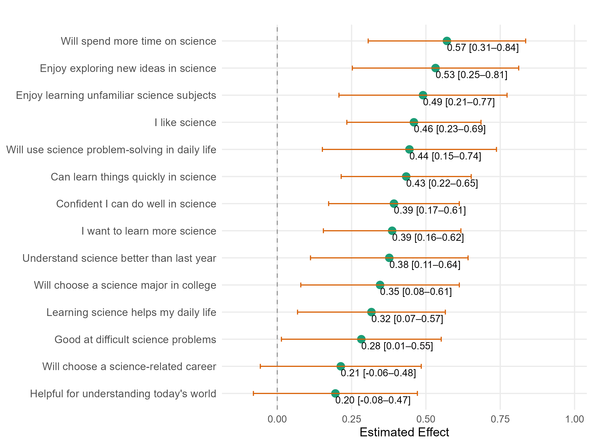{fig-align="center"
width="50%"}

:::: fragment
::: callout-note
### Multifaceted Impact

Positive Effects on 12 of 14 Outcomes
:::
::::

## Perceptions of Academic Excellence

**Post-intervention question:** "A student performs very well in
\[science/language arts\]. Is this student a boy or a girl?"

::::: columns
::: {.column width="50%"}
**Science Excellence**

-   Treatment effect: β = 0.55\*\*\*
-   Less likely to assume "boy"
-   More "could be either" responses
-   Domain-specific change
:::

::: {.column width="50%"}
**Language Arts Excellence**

-   Treatment effect: β = 0.45\*\*\*
-   Spillover to other domains
-   Shows consistency in thinking
:::
:::::

:::: fragment
::: callout-note
Intervention specifically reduced gender bias in science perceptions
:::
::::

# Proposed Experimental Study

## We Would Value Your Input {.smaller}

::::::::: columns
::::: {.column width="50%"}
:::: fragment
### Help Us Refine This Study

This experimental design is still in development. **We welcome your feedback on:**

-   Are the experimental conditions well-specified?
-   Are there alternative mechanisms we should test?
-   What additional measures would strengthen the design?
-   How might we improve ecological validity?
::::
:::::

::::: {.column width="50%"}
:::: fragment
### Questions for Discussion

-   Does the vignette approach adequately capture the experiential learning mechanism?
-   What boundary conditions should we explore?
-   Are there design elements that could be improved?

::: {.callout-tip}
## Your Expertise Matters

We're actively refining this study and would appreciate your suggestions and critiques.
:::
::::
:::::
:::::::::

## Testing the Mechanism: An Experimental Approach {.smaller}

:::: fragment
### The Question

Our field study shows **what** happens, but **why** does mixed-gender experiential learning reduce stereotypes?

::: {.callout-note}
## Key Mechanisms to Test

1. Is **equal-status contact** necessary, or is any mixed-gender interaction sufficient?
2. Does **collaboration** matter, or would solo learning produce similar effects?
3. Which **psychological mediators** drive the effect (norms, belonging, perceived competence)?
:::
::::

:::: fragment
### Proposed Design: Online Experiment with Visual Vignettes

-   **Participants:** U.S. respondents recruited via Prolific
-   **Method:** View illustrated comic strips depicting science learning scenarios
-   **Pre/Post measures:** Stereotype endorsement, science attitudes, norms
::::

## Experimental Conditions (4 Arms) {.smaller}

::::::::: columns
::::: {.column width="50%"}
:::: fragment
### 1. Mixed-Gender, Equal-Status (MG-Equal)

-   Boy and girl **alternate steps**
-   Both explain observations
-   Both make predictions
-   **Equal talk time and competence cues**
::::

:::: fragment
### 2. Same-Gender (SG)

-   Two boys (for male participants) or two girls (for female participants)
-   Same script and equal-status behavior
-   **Tests whether cross-gender contact is necessary**
::::
:::::

::::: {.column width="50%"}
:::: fragment
### 3. Mixed-Gender, Unequal-Status (MG-Unequal)

-   One gender leads, other observes passively
-   Minimal input from passive partner
-   **Tests whether equal status is necessary**
::::

:::: fragment
### 4. Solo Learning (Solo)

-   Single student performs same activity
-   Explains observations alone
-   **Tests whether collaboration matters**
::::
:::::
:::::::::

## Mixed-Gender, Equal-Status (MG-Equal) {.smaller}

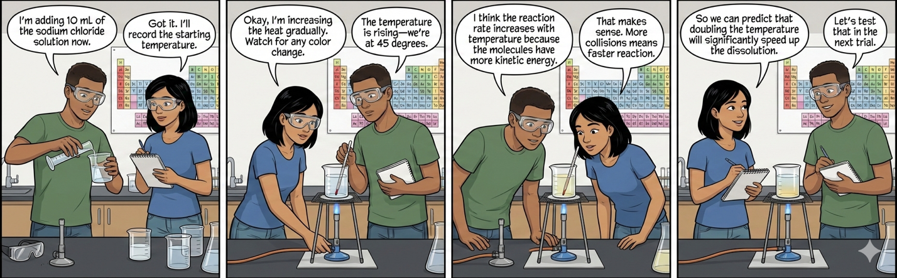{width="95%" fig-align="center"}

::: {.callout-tip}
## Key Feature
**Equal participation**: Alex (boy) and Maya (girl) alternate leading, explaining, and contributing equally throughout the experiment
:::

## Same-Gender: Two Boys (SG-Male) {.smaller}

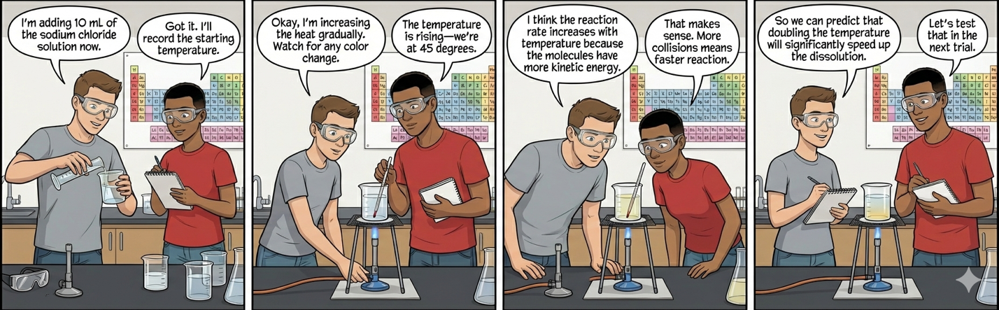{width="95%" fig-align="center"}

::: {.callout-tip}
## Key Feature
**Same-gender control**: Jake and Marcus (two boys) with equal participation. Tests whether **cross-gender contact** is necessary. *Shown to male participants.*
:::

## Same-Gender: Two Girls (SG-Female) {.smaller}

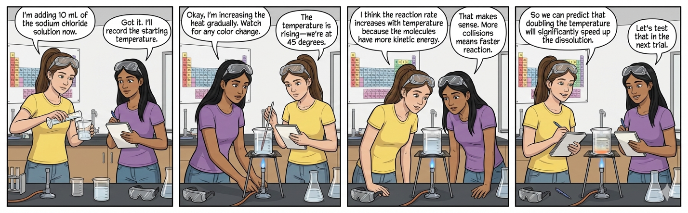{width="95%" fig-align="center"}

::: {.callout-tip}
## Key Feature
**Same-gender control**: Sofia and Priya (two girls) with equal participation. Tests whether **cross-gender contact** is necessary. *Shown to female participants.*
:::

## Mixed-Gender, Unequal: Boy Leads {.smaller}

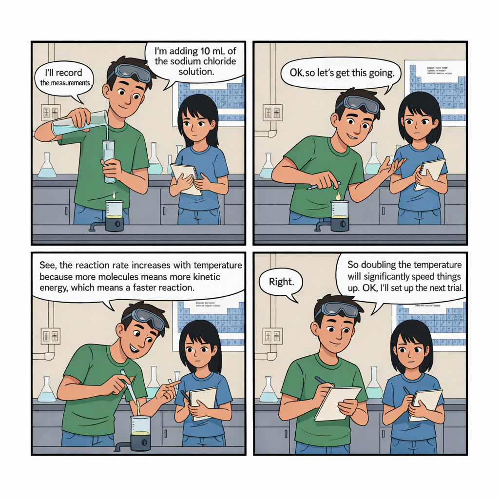{width="70%" fig-align="center"}

::: {.callout-tip}
## Key Feature
**Status manipulation**: Alex leads confidently while Maya responds passively ("Okay," "Mm-hmm," "Right"). Tests whether **equal status** is necessary for stereotype reduction.
:::

## Mixed-Gender, Unequal: Girl Leads {.smaller}

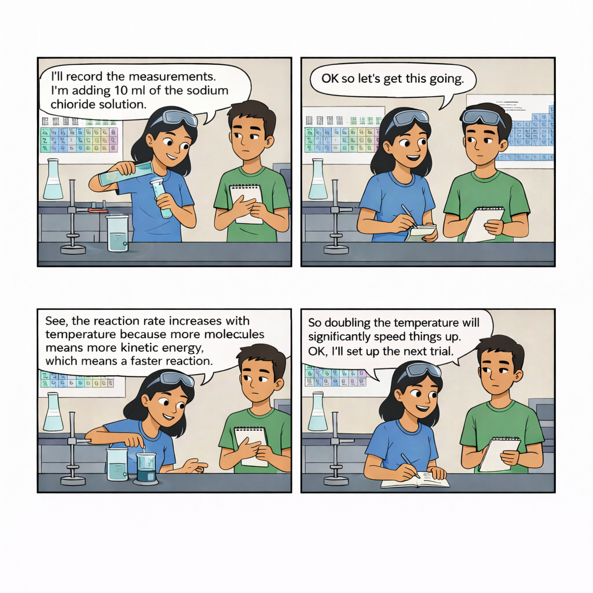{width="70%" fig-align="center"}

::: {.callout-tip}
## Key Feature
**Status manipulation**: Maya leads confidently while Alex responds passively. Counterbalanced to control for gender of leader.
:::

## Solo Learning: Male {.smaller}

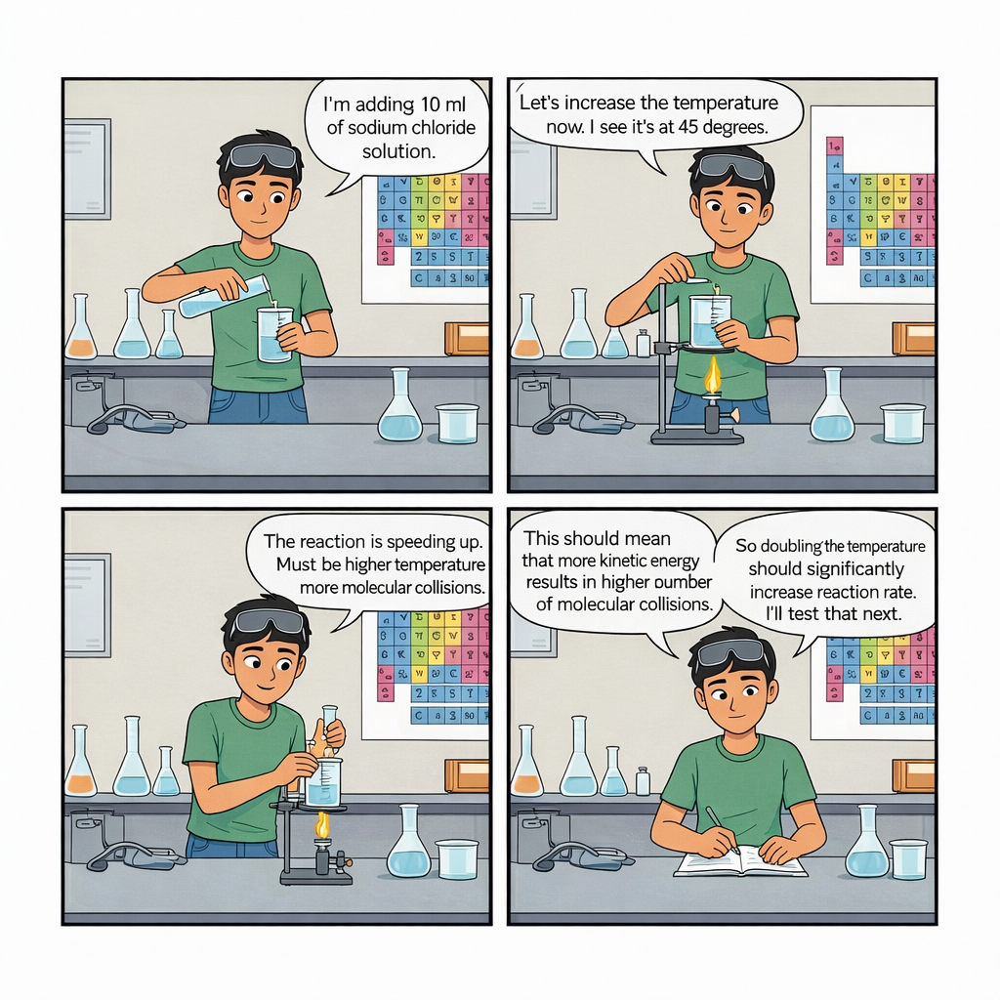{width="70%" fig-align="center"}

::: {.callout-tip}
## Key Feature
**No collaboration**: Alex performs the experiment alone. Tests whether **social interaction** is necessary for effects. *Shown to male participants.*
:::

## Solo Learning: Female {.smaller}

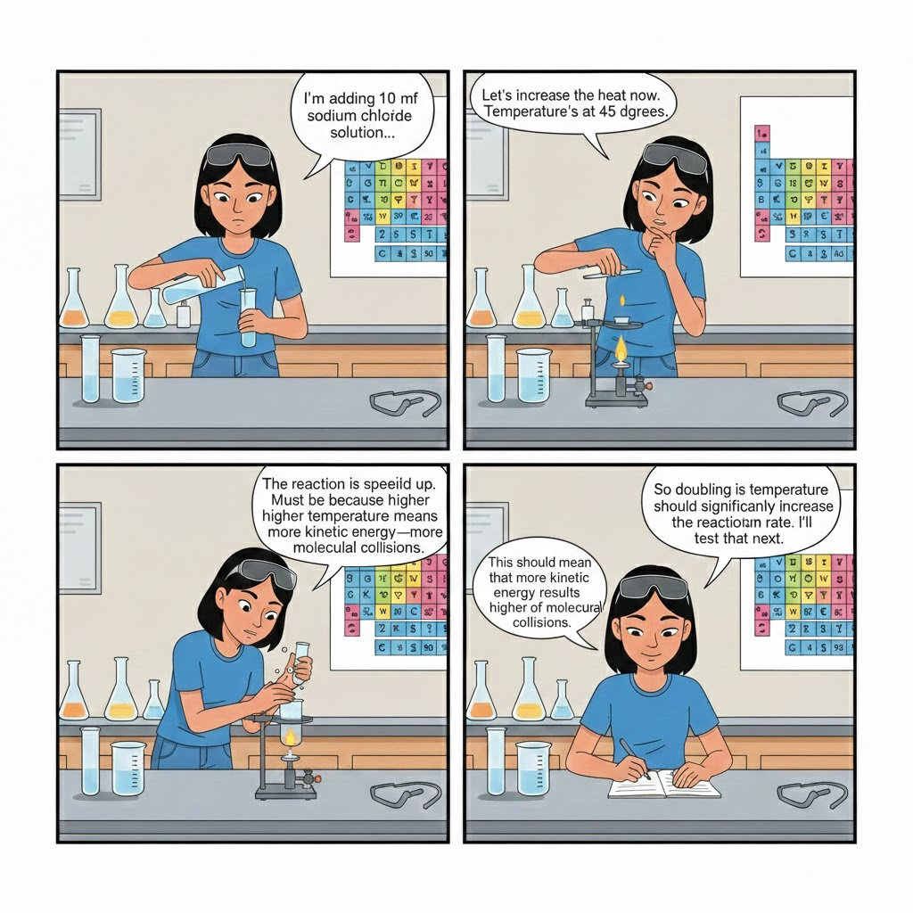{width="55%" fig-align="center"}

::: {.callout-tip}
## Key Feature
**No collaboration**: Maya performs the experiment alone. Same learning content but no social interaction. *Shown to female participants.*
:::

## Measurement Strategy {.smaller}

::::::::: columns
::::: {.column width="50%"}
:::: fragment
### Pre-Measures (Baseline)

-   Prior stereotype endorsement
-   Science interest and self-efficacy
-   Prior cross-gender academic contact
::::

:::: fragment
### Mechanism Measures (Post-Vignette)

**Perceived Norms:**

-   *Descriptive:* "Boys and girls both do well in science"
-   *Injunctive:* "Teachers approve of girls participating equally"

**Belonging:**

-   "People like me belong in science"

**Perceived Equal Status:**

-   "Both students had equal say"
-   "Both were equally capable"
::::
:::::

::::: {.column width="50%"}
:::: fragment
### Primary Outcomes

-   **Stereotype endorsement** (same items as baseline + scenario-based items)
::::

:::: fragment
### Secondary Outcomes

-   Science interest and enjoyment
-   Science self-efficacy
-   Behavioral intentions:
    -   "Choose a science elective"
    -   "Join a science club"
    -   "Watch more science content"
::::
:::::
:::::::::

## Expected Findings {.smaller}

::::::::: columns
::::: {.column width="80%"}
:::: fragment
### Hypotheses

1. **MG-Equal > all other conditions** for stereotype reduction
2. **MG-Unequal ≈ SG** (without equal status, cross-gender contact insufficient)
3. **Solo < Collaborative conditions** (interaction drives belief updating)
4. **Mediation:** Effects work through perceived norms and belonging
::::
:::::

:::::::::

:::: fragment
::: {.callout-important}
## Bottom Line

This experiment will provide **causal evidence** for the specific mechanisms underlying stereotype reduction through experiential learning
:::
::::

# Discussion

## Theoretical Contributions {.smaller}

::: fragment
### Marketing Theory: Shared Consumption & Belief Updating

**Science as a "Brand Problem":**

-   "Science is for men" = symbolic branding issue
-   Constrains inclusion and market participation
-   Identity-linked consumption framework (Chen et al., 2024; Oyserman, 2009)
:::

::: fragment
**Mixed-Gender Experiential Learning as Solution:**

-   **Shared consumption** creates opportunities for belief updating
-   Students observe counter-stereotypical competence firsthand
-   Direct evidence triggers revision of gender-science associations
-   Shifts brand from "for boys" → "for us"
:::

:::: fragment
::: callout-tip
## Extension to Marketing

Shared experiential consumption can trigger **belief updating** that shifts identity associations in stigmatized or exclusionary domains
:::
::::

## Policy Implications {.smaller}

::::::::: columns
::::: {.column width="50%"}
:::: {.fragment data-fragment-index="1"}
### For NGOs & Policy Makers

- Value proposition extends beyond achievement
- Mobile labs rewrite social scripts
- Scalable to resource-constrained contexts
::::
:::::

::::: {.column width="50%"}
:::: {.fragment data-fragment-index="2"}
### For Corporate Funders

- Long-horizon workforce investment
- Co-design mixed-gender experiences
- Present science as collaborative, not competitive
::::
:::::
:::::::::

:::: {.fragment data-fragment-index="3"}
### For School Leaders & Teachers

- Design of everyday group-work matters
- Especially important in larger schools
- Structure equal-status collaboration
::::

## Alignment with UN Sustainable Development Goals {.smaller}

:::: {.columns}

::: {.column width="40%"}
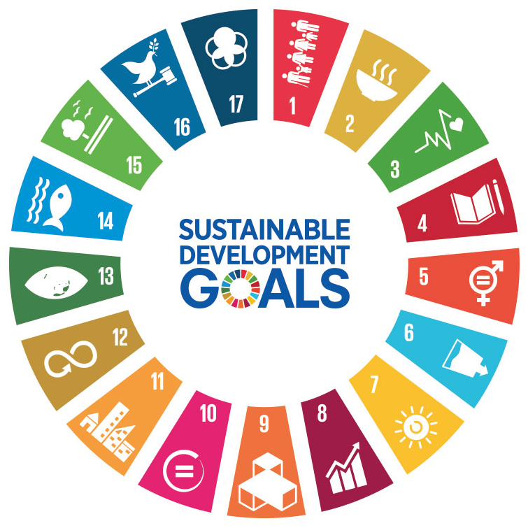{width="65%"}
:::

::: {.column width="10%"}

:::
::: {.column width="50%"}
::: {.fragment}
### SDG 4: Quality Education

- Improved learning outcomes
- Inquiry-based pedagogy
- Accessible to underserved areas
- Scalable intervention model
:::

 
 

::: {.fragment}
### SDG 5: Gender Equality

- Reduced gender stereotypes
- Enhanced sense of belonging
- Inclusive science identity
- Equitable participation
:::
:::

::::

::: {.fragment}
::: {.callout-tip}
## Relevance

Demonstrates how educational interventions can **jointly advance learning and equity** worldwide
:::
:::

# Conclusion

## Main Findings Summary {.nonincremental}

::::: columns
::: {.column .fragment width="50%"}
**Learning Outcomes**

[↑]{style="color: #500000; font-weight: bold; font-size: 1.2em;"} **14
pp gain** in science knowledge 
[✓]{style="color: #500000; font-weight: bold; font-size: 1.2em;"}
Consistent across all genders 
[✓]{style="color: #500000; font-weight: bold; font-size: 1.2em;"} Robust
to matching procedures 
[↑]{style="color: #500000; font-weight: bold; font-size: 1.2em;"}
Improved attitudes across 12/14 dimensions
:::

::: {.column .fragment width="50%"}
**Attitudinal Outcomes**

[↓]{style="color: #500000; font-weight: bold; font-size: 1.2em;"} **20%
reduction** in gender stereotypes 
[↑]{style="color: #500000; font-weight: bold; font-size: 1.2em;"}
Stronger effects for boys 
[↑]{style="color: #500000; font-weight: bold; font-size: 1.2em;"}
Slightly Amplified in larger schools 
[✓]{style="color: #500000; font-weight: bold; font-size: 1.2em;"}
Scalable across diverse classes
:::
:::::

 

:::: fragment
::: callout-important
## Bottom Line

Mixed-gender experiential learning operates as both a **pedagogical
intervention** and a **social process** that triggers **belief updating** through shared consumption.

Making science feel like it's "for people like me" requires not just
supporting girls' identities, but also reshaping boys' perceptions through direct observation of cross-gender competence
:::
::::

## Thank You {.center data-background-color="#FFFFFF"}

Questions & Comments?

Shrihari (Hari) Sridhar

Joe B Foster '56 Chair in Business Leadership

Senior Associate Dean

Mays Business School | Texas A&M University

<a href="mailto:ssridhar@mays.tamu.edu" style="font-size: 0.8em; color: #500000; text-decoration: none; font-weight: bold;">ssridhar@mays.tamu.edu</a>

# Appendix {visibility="uncounted"}

## Moderation by School Size {.smaller visibility="uncounted"}

:::: {.columns}

::: {.column width="78%"}
### Regression Results

::: {.smaller}
| Parameter | Science Knowledge Score |   | Gender-Stereotype Attitudes |   |
|---|---|---|---|---|
|   | Coef. (S.E.) | p-value | Coef. (S.E.) | p-value |
| [**Treatment × Post × School Size**]{.my-crimson} | -0.009 (0.014) | .50 | [**-0.002 (0.001)**]{.my-crimson} | [**.011**]{.my-crimson} |
| Treatment × Post | 12.981 (3.289) | <.001 | -0.781 (0.205) | <.001 |
| Post × School Size | 0.006 (0.013) | .636 | 0.002 (0.001) | .032 |
| Post | -0.025 (3.115) | .99 | 0.125 (0.188) | .51 |
| **N** | 10,368 |   | 10,150 |   |
| **R²** | .379 |   | .239 |   |

*Fixed Effects: School × Grade; Standard errors clustered at school level*
*School size mean-centered and winsorized at 99th percentile*
:::
:::

::: {.column width="22%"}

::: {.r-stack}

::: {.fragment .fade-in-then-out fragment-index=1}
::: {.callout-note}
## Knowledge

**p = .50**

NOT significant

Learning gains consistent across school sizes
:::
:::

::: {.fragment fragment-index=2}
::: {.callout-important}
## Stereotypes

**p = .011**

Statistically significant

**But:** Effect is small (coef = -0.002)

Larger schools show *modestly* stronger stereotype reduction
:::
:::

:::

:::

::::

## Why Do Larger Schools Show Modestly Stronger Effects? {.smaller visibility="uncounted"}

### The Pattern (Small but Significant)

**Statistically detectable, substantively modest**

### Possible Explanation

**Organizational sorting hypothesis:**

- Larger schools have **more salient gendered norms** (greater gender segregation in peer groups)
- **Structured contact becomes relatively more valuable** (MSL provides rare cross-gender collaboration)
- Consistent with organizational theory (Blau, 1970)

::: {.callout-note}
## Interpretation
School context **slightly** moderates effects, but the intervention works well across all school sizes
:::

## No Moderation by Class Characteristics {visibility="uncounted"}

::::: columns
::: {.column width="50%"}
**Class Size**

-   Knowledge: β = 0.42, p = .15
-   Stereotypes: β = -0.00, p = .997

✓ Scalable across classroom sizes
:::

::: {.column width="50%"}
**Proportion of Girls**

-   Knowledge: β = -1.96, p = .90
-   Stereotypes: β = 0.67, p = .49

✓ Works in diverse compositions
:::
:::::

:::: fragment
::: callout-tip
## Practical Implication

Program effective regardless of classroom structure or gender
composition
:::
::::

